


<a href="./CV_Moshiur_Rahman.pdf">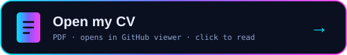</a>

 

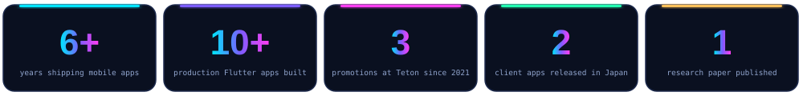

## `> whoami`

I'm **Moshiur Rahman**, a Flutter engineer with 6+ years of production experience. I started as a solo developer, and today I **lead the app team at Teton Private Ltd.** My apps read ECG machines over USB, talk to smart scales and toy trains over Bluetooth, and track a field sales team over GPS. My consumer apps are live on the App Store and Google Play. BRAC University alumnus, based in Dhaka, Bangladesh.

---

## `> from --idea --to release`

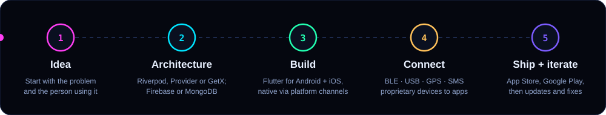

---

## `> why --hire-me`

*I lead from the codebase, not just the roadmap. I came up through the code, so I can set direction for a team and still step into the hardest integration myself.*

| | | |
|---|---|---|
| **🚀 End to end** I take products from architecture to the stores. 10+ production Flutter apps across health, fitness, gaming, enterprise and safety. | **🔌 Hardware** BLE for toy trains and smart scales, USB for ECG machines, plus GPS, SMS and Arduino. | **🧭 Leadership** I set technical direction, mentor junior developers and coordinate design, backend and hardware. |
| **📈 Growth** Software Engineer I in 2021, Team Lead in October 2026, a promotion at every step. | **🧩 Range** Riverpod, Provider or GetX. Firebase or MongoDB. Platform channels or a custom SDK when Flutter alone isn't enough. | **🌏 Global** Two apps shipped for clients in Japan, including a fully Japanese-localized ordering app for KEIAI. |

---

## `> git log --career`


---

## `> showcase --top 3`

<table>
<tr>
<td width="46%">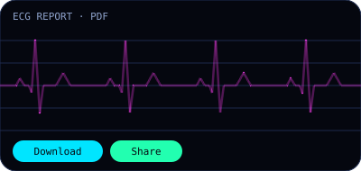</td>
<td valign="top">

**Teton Health** · *Health · 2025–26*

Companion app for Teton's ECG devices (Lead 2, 6 and 12), built around a direct **USB** connection. ECG PDF generation, download and sharing, subscriptions and broader health-metric tracking.

`Riverpod` `USB` `MongoDB` `Flutter`

</td>
</tr>
<tr>
<td valign="top">

**Teton Fitness Scale** · *Fitness · 2023–24*

Started as a Flutter **SDK** for Android and iOS that talks to Teton's smart bath scales over **BLE**, then folded into the consumer app. Weight, visceral fat, body water and muscle mass.

`Provider` `BLE` `Firebase` `SDK`

</td>
<td width="46%"></td>
</tr>
<tr>
<td width="46%">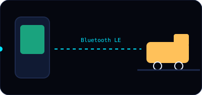</td>
<td valign="top">

**Teton Train** · *Gaming and toys · 2021–22*

A physical toy locomotive and a game, controlled together. I built the **Bluetooth LE** link and rebuilt the game from Unity into Flutter with multiple levels and scenarios.

`BLE` `Unity` `Flutter`

</td>
</tr>
</table>

---

## `> ls ./products`

<b>All 10 products, and what I did on each</b> (click to collapse)

 

| Product | Domain | What I built |
|---|---|---|
| **Teton HR** (2026) | Enterprise | Field-sales app: clock-in with photo + GPS verification, live tracker with movement heatmap, attendance, dealer registration and list, activities log, integrated with the HRMS. |
| **Teton Health** ★ | Health | ECG companion over USB: PDF reports, sharing, subscriptions, health metrics. *Riverpod, MongoDB* |
| **Shara – Emergency SOS** | Safety | Works offline (SMS-triggered SOS via server) and online (alerts volunteers within 2 km and trusted contacts). Full chat with media. *GetX, MongoDB* |
| **Teton Fitness Scale** ★ | Consumer | Flutter SDK + app for BLE smart scales. *Provider, Firebase* |
| **Teton Meal App** | Consumer | Meal planning and ordering for Teton's consumer line. |
| **Teton Train** ★ | Gaming | BLE-controlled toy locomotive + Flutter game. |
| **KEIAI Order App** | Japan client | Fully Japanese-localized ordering app: search, cart, order history. |
| **Classic Golf App** | Japan client | Zendesk chat SDK and Pushwoosh push notifications. |
| **ChatApp** | Side project | Real-time one-to-one chat on Firebase with an activity-sorted inbox. |
| **Algorithm Visualizer** | Side project | Interactive sorting and search visualizer with speed controls. |

---

## `> stack --in-practice`

*Three state-management approaches, two hardware transports, two databases and a localized release. I pick the tools the product needs.*

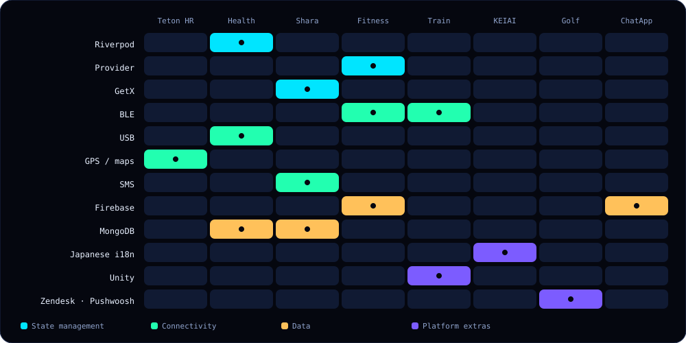

---

## `> map --integrations`

*One phone, five ways to reach the real world: Bluetooth LE (dashed blue), USB (solid red), GPS and network, SMS and network.*

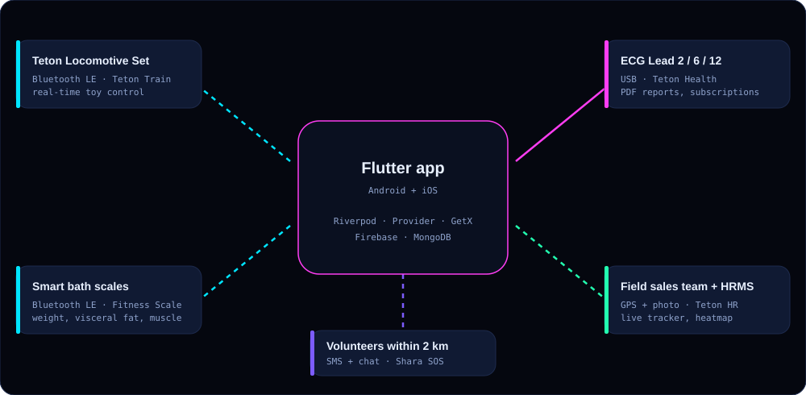

---

## `> team --lead`

*Since October 2026 I lead Teton's app development team: technical direction, mentoring, coordination, and ownership of the full app portfolio.*

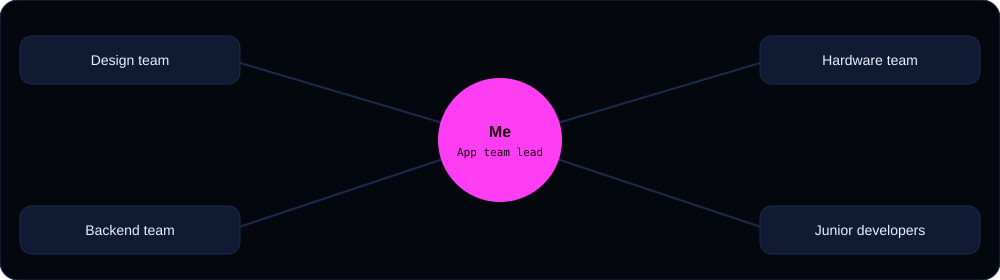

---

## `> cat education.md`

🎓 **B.Sc. in Computer Science and Engineering**, BRAC University (2015–2019)
📚 **Published:** *Automated Soil Testing System using Colorimetry and Arduino*, IEM-ICDC 2020, India

---

### Looking for someone to lead your app team? Let's talk.

<picture>
  <source media="(prefers-color-scheme: dark)" srcset="https://raw.githubusercontent.com/moshiur-rahmaan/moshiur-rahmaan/output/snake-dark.svg">
  
</picture>

